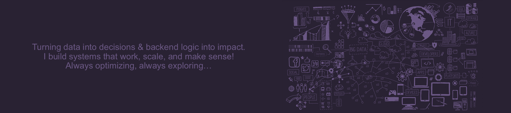

***

---

## 👋 Hi There
I'm **Aditi**, a tech enthusiast with hands-on experience in Web Development oriented towards AI/ML-Data Science & Data Analytics. 

## **Software Engineer | Full-Stack Developer | AI/ML Explorer | Data Analytics Enthusiast**

With a strong foundation in backend development and data analytics, I aim to create systems that address real-world challenges,  
Driven by the precision of data and the potential of AI, I specialize in building scalable systems and practical solutions,  
Always exploring new technologies to refine processes and improve efficiency.

**Core Skills**

- Build full-stack web apps that scale — fast and clean.
- Integrate AI/ML models into real-world products using tools like **LangChain**, **scikit-learn**, and **TensorFlow**.
- Translate raw data into visual stories using **Power BI**, **Tableau**, and **Looker Studio**.
- Explore ways to make systems smarter, faster, and more helpful through automation and data.

---

### Skills

**Data Science & Machine Learning** 

  
**Databases** 

  
**Backend / API Development** 

  
**Frontend & UI Development** 

  
**BI, Data Analytics & Visualization Tools** 

  
**Cloud & Platforms** 

  
**Core Programming & Concepts** 

  
**IDE & Tools** 

  

***

  Turning data into decisions & backend logic into impact. 
  I build systems that work, scale, and make sense! 
  Always optimizing, always exploring…

